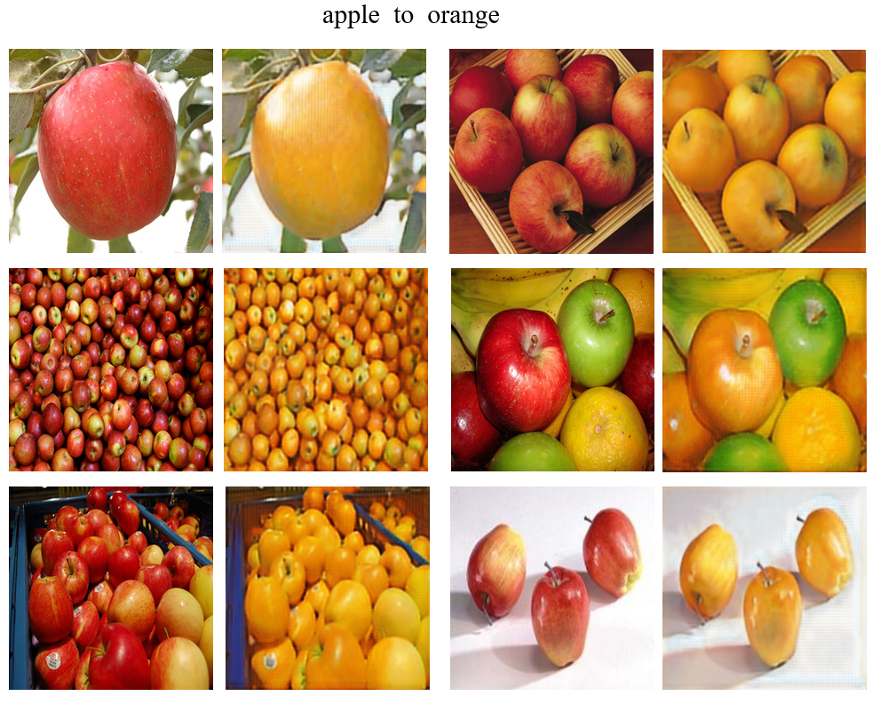
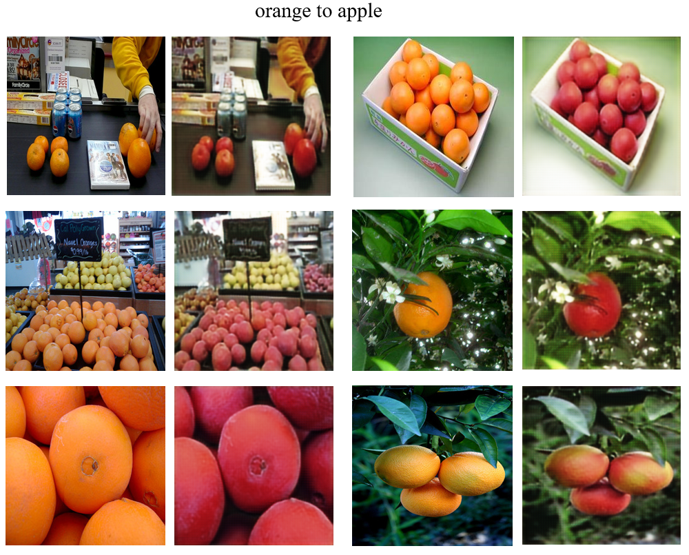
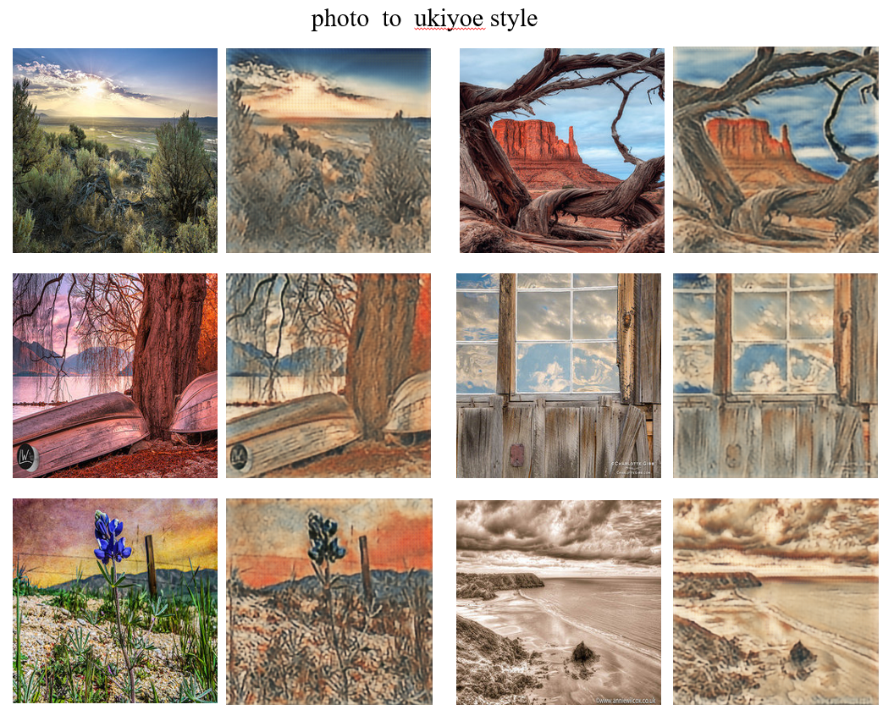

# MXNET-Scala CycleGAN
MXNet-scala module implementation of cycleGAN[1].

Based on: 
https://github.com/junyanz/CycleGAN

So far, I have tried all the tasks and done a lot of experiments,

but just success in two tasks: "apple2orange" and "".

I think I followed the torch implementation completely and couldn't locate the problem :( .


## Results:

<div align='center'>
  
</div>

<div align='center'>
  
</div>

<div align='center'>
  
</div>


### Requirements

* sbt 0.13 http://www.scala-sbt.org/
* Mxnet https://github.com/dmlc/mxnet

### steps

1, compile Mxnet with CUDA, then compile the scala-pkg，doc： https://github.com/dmlc/mxnet/tree/master/scala-package

2, under the Mxnet-Scala/FastNeuralStyle folder 
```bah
 mkdir lib;
```
3, copy your compiled mxnet-full_2.11-linux-x86_64-gpu-0.1.2-SNAPSHOT.jar into lib folder;

4, run `sbt` then compile the project

## Datasets
you can download the datasets with the `datasets/download_dataset.sh`. you can refer to https://github.com/junyanz/CycleGAN
for how to use this script.

## Testing

you can try the pretrained model of "apple2orange" and "photo2ukiuoe" with the `scripts/test_cycle_gan.sh` script.
The pretrain model zip file is under `models` folder.

you need to provide the input image file.

If you use the apple2orange model, A means apple, B means orange.

If you use the photo2ukiuoe model, only has on direction, BtoA, B means photo.

```bash
# pretrain models are under the $ROOT/datas/pretrain_models directory
PREAREIN_G_MODEL=$ROOT/models/pretrain_models/

INPUT_IMAGE=

# -1 for cpu
GPU=0

# "AtoB" or "BtoA"
DIRECTION="BtoA"
```

## Training new models

use the `train_cycle_gan.sh` script under `scripts` folder.
If you keep all the default settings, you just need to provide the domainA images path and domainB images path:
```bash
DOMAIN_A_PATH=
DOMAIN_B_PATH=
```

## License
MIT

## Reference
[1] Zhu, Jun Yan, et al. "Unpaired Image-to-Image Translation using Cycle-Consistent Adversarial Networks." 2017.
