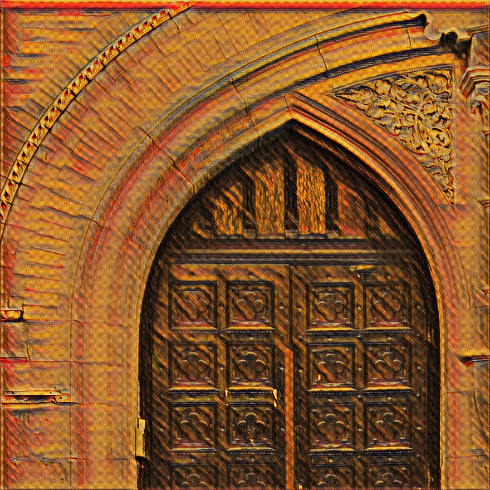
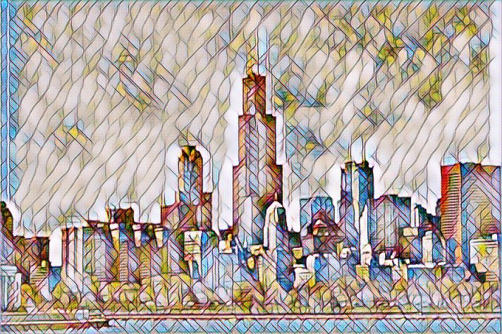
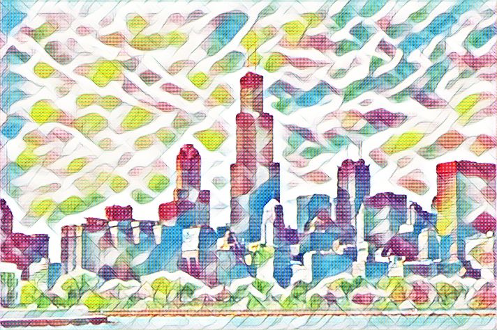
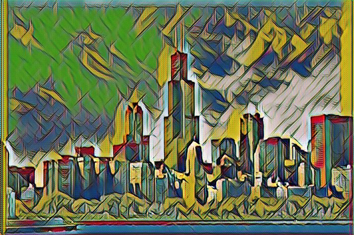
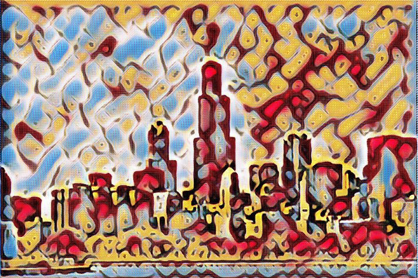

# MXNET-Scala Fast Neural Style
MXNet-scala module implementation of fast neural style[1].

Based on: 

https://github.com/jcjohnson/fast-neural-style and https://github.com/dmlc/mxnet/tree/master/example/neural-style/end_to_end

The results are not as good as the torch version but not bad anyway :)

Time: 0.075 seconds in average on NVIDIA GTX 1070 GPU for resolution of 712 x 414.

## Results:

<div align='center'>
  
  
</div>
<br>
<div align='center'>
  
  
  
</div>
<br>
<div align='center'>
  
  
</div>
<br>
<div align='center'>
  
  
</div>
<br>
<div align='center'>
  
  
</div>
<br>
<div align='center'>
  
  
</div>
<br>
<div align='center'>
  
  
</div>
<br>
<div align='center'>
  
  
</div>

## Setup
Tested on Ubuntu 14.04

### Requirements

* sbt 0.13 http://www.scala-sbt.org/
* Mxnet https://github.com/dmlc/mxnet

### steps

1, compile Mxnet with CUDA, then compile the scala-pkg，doc： https://github.com/dmlc/mxnet/tree/master/scala-package

2, under the Mxnet-Scala/FastNeuralStyle folder 
```bah
 mkdir lib;
```
3, copy your compiled mxnet-full_2.11-linux-x86_64-gpu-0.1.2-SNAPSHOT.jar into lib folder;

4, run `sbt` then compile the project

## Running on new images
The script `run_fast_neural_style.sh` under the scripts folder, lets you use a pretrained model to stylize new images:

```bash
java -Xmx1G -cp $CLASS_PATH \
	FastNeuralStyle \
	--model-path  $PREAREIN_MODEL \
	--input-image $INPUT_IMAGE \
	--output-path $OUTPUT_PATH \
	--gpu $GPU
```
You can run this script on CPU or GPU, 

For cpu set the GPU flag to -1;

For gpu plesase specifying the GPU number on which to run.

Some pretrained style models are in `datas/pretrain_models`


## Training new models

1, download the vgg model 

```bash
cd scripts
bash download_vgg_model.sh
```
This will download the pretrained vgg model file (~80MB) to the folder `datas/vggmodel`.

2, download the Coco dataset：http://msvocds.blob.core.windows.net/coco2015/test2015.zip

3, use the script `train_fast_nueral_style.sh` under the scripts folder to train on new style image.

you just need to set the `TRAIN_DATA_PATH` flag to your coco dataset path and `STYLE_IMAGE` flag to your own style images.

```bash
# path to the coco dataset,
# you can download it by : http://msvocds.blob.core.windows.net/coco2015/test2015.zip
TRAIN_DATA_PATH=

VGG_MODEL=$ROOT/datas/vggmodel/vgg19.params

SAVE_MODEL_PATH=$ROOT/datas/models

STYLE_IMAGE=$ROOT/datas/images/the_scream.jpg

LEARNING_RATE=0.0001

# resume the training progress
# by adding the commamd line parameter: 
# --resume-model-path $RESUME_MODEL_PATH
RESUME_MODEL_PATH=

# -1 for cpu
GPU=0

java -Xmx1G -cp $CLASS_PATH \
	Train \
	--data-path $TRAIN_DATA_PATH \
	--vgg-model-path $VGG_MODEL \
	--save-model-path $SAVE_MODEL_PATH \
	--style-image $STYLE_IMAGE \
	--lr $LEARNING_RATE \
	--gpu $GPU
```
For now, the training program only support training batch size 1, and the program may crash during the training process, 
can't figure out the reason. If you encounter this situasion, you can set the `RESUME_MODEL_PATH` to your lastest 
saved model (a mdoel will be saved every 1000 iters udring training), then use the `--resume-model-path` command line
parameter to resume the training.

## License
MIT

## Reference
[1] Johnson, Justin, Alexandre Alahi, and Li Fei-Fei. "Perceptual losses for real-time style transfer and super-resolution." arXiv preprint arXiv:1603.08155.

