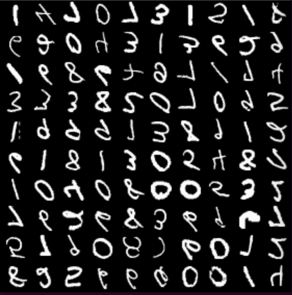
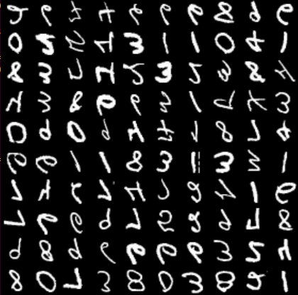
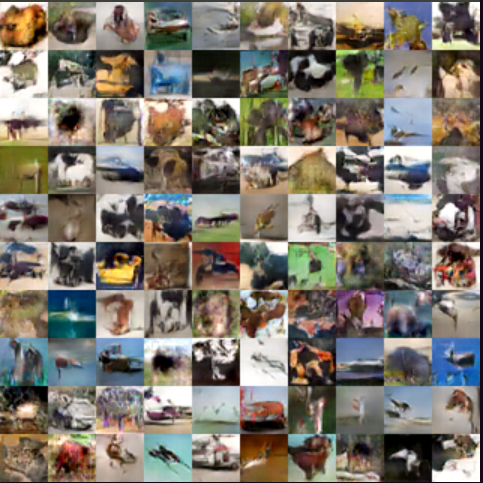

# MXNET-Scala GAN
MXNet-scala module implementation of Generative Adversarial Net.

Based on: https://github.com/tqchen/mxnet-gan

## Building

Tested on Ubuntu 14.04

### Requirements

* sbt 0.13
* Mxnet 

### steps

1, compile Mxnet with CUDA, then compile the scala-pkg;

2, cd into Mxnet-Scala/Gan, mkdir lib;

3, then copy the compiled mxnet-full_2.11-INTERNAL.jar into lib folder

4, run sbt and compile the project

## Running

* cd scripts; bash run_gan_cifar10.sh or bash run_gan_mnist.sh; then have fun!
* 

## Some results generated by the networks

### Mnist

### Cifar10

