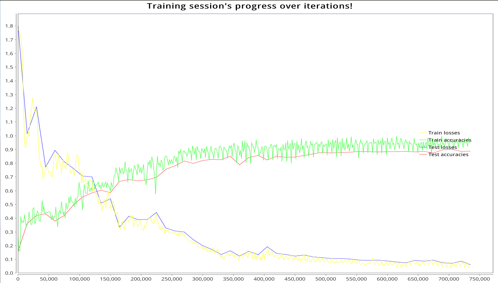

# MXNET-Scala Human Activity Recognition
MXNet-scala module implementation of LSTM for Human Activity Recognition.

Based on: https://github.com/guillaume-chevalier/LSTM-Human-Activity-Recognition

and got nearly the same results.

## Building

Tested on Ubuntu 14.04

### Requirements

* sbt 0.13
* Mxnet

### steps

1, compile Mxnet with CUDA, then compile the scala-pkg;

2, cd into Mxnet-Scala/HumanActivityRecognition, then mkdir lib;

3, copy your compiled mxnet-full_2.11-linux-x86_64-gpu-0.1.2-SNAPSHOT.jar into lib folder;

4, run sbt, compile the project

## Running

* cd scripts;
* bash run.sh

then have fun!

## Training logs
```
Iter 1500, Batch Loss = 1.780415, Accuracy = 0.26266667
TEST SET DISPLAY STEP:  Batch Loss = 1.798351, Accuracy = 0.16016288
Iter 15000, Batch Loss = 0.933169, Accuracy = 0.33733332
TEST SET DISPLAY STEP:  Batch Loss = 1.017054, Accuracy = 0.35934848
Iter 30000, Batch Loss = 1.203503, Accuracy = 0.364
TEST SET DISPLAY STEP:  Batch Loss = 1.210487, Accuracy = 0.41940957
Iter 45000, Batch Loss = 0.740827, Accuracy = 0.43066666
TEST SET DISPLAY STEP:  Batch Loss = 0.772413, Accuracy = 0.43094674
Iter 60000, Batch Loss = 0.852083, Accuracy = 0.412
TEST SET DISPLAY STEP:  Batch Loss = 0.893236, Accuracy = 0.3790295
Iter 75000, Batch Loss = 0.823337, Accuracy = 0.426
TEST SET DISPLAY STEP:  Batch Loss = 0.811571, Accuracy = 0.4183916
Iter 90000, Batch Loss = 0.753601, Accuracy = 0.518
TEST SET DISPLAY STEP:  Batch Loss = 0.760808, Accuracy = 0.49677637
Iter 105000, Batch Loss = 0.655924, Accuracy = 0.5326667
TEST SET DISPLAY STEP:  Batch Loss = 0.705918, Accuracy = 0.5551408
Iter 120000, Batch Loss = 0.671545, Accuracy = 0.62133336
TEST SET DISPLAY STEP:  Batch Loss = 0.700519, Accuracy = 0.5846624
Iter 135000, Batch Loss = 0.520920, Accuracy = 0.64133334
TEST SET DISPLAY STEP:  Batch Loss = 0.509846, Accuracy = 0.60366476
Iter 150000, Batch Loss = 0.529982, Accuracy = 0.628
TEST SET DISPLAY STEP:  Batch Loss = 0.541752, Accuracy = 0.586359
Iter 165000, Batch Loss = 0.337939, Accuracy = 0.66933334
TEST SET DISPLAY STEP:  Batch Loss = 0.333877, Accuracy = 0.6671191
Iter 180000, Batch Loss = 0.384434, Accuracy = 0.6626667
TEST SET DISPLAY STEP:  Batch Loss = 0.414936, Accuracy = 0.68069226
Iter 195000, Batch Loss = 0.369616, Accuracy = 0.71533334
TEST SET DISPLAY STEP:  Batch Loss = 0.388370, Accuracy = 0.672209
Iter 210000, Batch Loss = 0.355249, Accuracy = 0.64533335
TEST SET DISPLAY STEP:  Batch Loss = 0.391691, Accuracy = 0.6789956
Iter 225000, Batch Loss = 0.431139, Accuracy = 0.57533336
TEST SET DISPLAY STEP:  Batch Loss = 0.441554, Accuracy = 0.6973193
Iter 240000, Batch Loss = 0.285340, Accuracy = 0.84066665
TEST SET DISPLAY STEP:  Batch Loss = 0.328950, Accuracy = 0.75500506
Iter 255000, Batch Loss = 0.289774, Accuracy = 0.8513333
TEST SET DISPLAY STEP:  Batch Loss = 0.307293, Accuracy = 0.7804547
Iter 270000, Batch Loss = 0.276257, Accuracy = 0.8846667
TEST SET DISPLAY STEP:  Batch Loss = 0.299869, Accuracy = 0.8154055
Iter 285000, Batch Loss = 0.221921, Accuracy = 0.92466664
TEST SET DISPLAY STEP:  Batch Loss = 0.242042, Accuracy = 0.79911774
Iter 300000, Batch Loss = 0.195684, Accuracy = 0.908
TEST SET DISPLAY STEP:  Batch Loss = 0.199364, Accuracy = 0.8191381
Iter 315000, Batch Loss = 0.165992, Accuracy = 0.92266667
TEST SET DISPLAY STEP:  Batch Loss = 0.172706, Accuracy = 0.8269427
Iter 330000, Batch Loss = 0.130108, Accuracy = 0.9253333
TEST SET DISPLAY STEP:  Batch Loss = 0.135752, Accuracy = 0.8259247
Iter 345000, Batch Loss = 0.123394, Accuracy = 0.92733335
TEST SET DISPLAY STEP:  Batch Loss = 0.162172, Accuracy = 0.85103494
Iter 360000, Batch Loss = 0.091235, Accuracy = 0.9173333
TEST SET DISPLAY STEP:  Batch Loss = 0.124131, Accuracy = 0.7896166
Iter 375000, Batch Loss = 0.110845, Accuracy = 0.9166667
TEST SET DISPLAY STEP:  Batch Loss = 0.158513, Accuracy = 0.8408551
Iter 390000, Batch Loss = 0.096496, Accuracy = 0.922
TEST SET DISPLAY STEP:  Batch Loss = 0.134032, Accuracy = 0.85714287
Iter 405000, Batch Loss = 0.147098, Accuracy = 0.91933334
TEST SET DISPLAY STEP:  Batch Loss = 0.192178, Accuracy = 0.82422805
Iter 420000, Batch Loss = 0.128252, Accuracy = 0.918
TEST SET DISPLAY STEP:  Batch Loss = 0.143951, Accuracy = 0.8517136
Iter 435000, Batch Loss = 0.113734, Accuracy = 0.8986667
TEST SET DISPLAY STEP:  Batch Loss = 0.135311, Accuracy = 0.8439091
Iter 450000, Batch Loss = 0.110106, Accuracy = 0.94
TEST SET DISPLAY STEP:  Batch Loss = 0.124025, Accuracy = 0.8449271
Iter 465000, Batch Loss = 0.127751, Accuracy = 0.928
TEST SET DISPLAY STEP:  Batch Loss = 0.131118, Accuracy = 0.8561249
Iter 480000, Batch Loss = 0.112045, Accuracy = 0.9433333
TEST SET DISPLAY STEP:  Batch Loss = 0.117775, Accuracy = 0.86868
Iter 495000, Batch Loss = 0.100415, Accuracy = 0.956
TEST SET DISPLAY STEP:  Batch Loss = 0.111091, Accuracy = 0.8805565
Iter 510000, Batch Loss = 0.092717, Accuracy = 0.95266664
TEST SET DISPLAY STEP:  Batch Loss = 0.106292, Accuracy = 0.8754666
Iter 525000, Batch Loss = 0.078547, Accuracy = 0.956
TEST SET DISPLAY STEP:  Batch Loss = 0.106027, Accuracy = 0.8788599
Iter 540000, Batch Loss = 0.097594, Accuracy = 0.88733333
TEST SET DISPLAY STEP:  Batch Loss = 0.101987, Accuracy = 0.87987787
Iter 555000, Batch Loss = 0.094006, Accuracy = 0.8386667
TEST SET DISPLAY STEP:  Batch Loss = 0.094256, Accuracy = 0.8866644
Iter 570000, Batch Loss = 0.074015, Accuracy = 0.87866664
TEST SET DISPLAY STEP:  Batch Loss = 0.091538, Accuracy = 0.8846284
Iter 585000, Batch Loss = 0.092351, Accuracy = 0.8653333
TEST SET DISPLAY STEP:  Batch Loss = 0.094474, Accuracy = 0.8819138
Iter 600000, Batch Loss = 0.087074, Accuracy = 0.862
TEST SET DISPLAY STEP:  Batch Loss = 0.089067, Accuracy = 0.88394976
Iter 615000, Batch Loss = 0.072428, Accuracy = 0.93266666
TEST SET DISPLAY STEP:  Batch Loss = 0.081364, Accuracy = 0.88394976
Iter 630000, Batch Loss = 0.063190, Accuracy = 0.9533333
TEST SET DISPLAY STEP:  Batch Loss = 0.075417, Accuracy = 0.8866644
Iter 645000, Batch Loss = 0.072255, Accuracy = 0.982
TEST SET DISPLAY STEP:  Batch Loss = 0.091810, Accuracy = 0.8819138
Iter 660000, Batch Loss = 0.069323, Accuracy = 0.954
TEST SET DISPLAY STEP:  Batch Loss = 0.085984, Accuracy = 0.88632506
Iter 675000, Batch Loss = 0.063361, Accuracy = 0.98066664
TEST SET DISPLAY STEP:  Batch Loss = 0.093897, Accuracy = 0.87410927
Iter 690000, Batch Loss = 0.047272, Accuracy = 0.996
TEST SET DISPLAY STEP:  Batch Loss = 0.074714, Accuracy = 0.89786226
Iter 705000, Batch Loss = 0.037897, Accuracy = 0.97333336
TEST SET DISPLAY STEP:  Batch Loss = 0.071891, Accuracy = 0.90091616
Iter 720000, Batch Loss = 0.048627, Accuracy = 0.948
TEST SET DISPLAY STEP:  Batch Loss = 0.086670, Accuracy = 0.8856464
Iter 735000, Batch Loss = 0.036653, Accuracy = 0.948
TEST SET DISPLAY STEP:  Batch Loss = 0.061301, Accuracy = 0.88734305
FINAL RESULT: Batch Loss= 0.061300557, Accuracy= 0.88734305
Done
```
 

## Visualization of the training process




