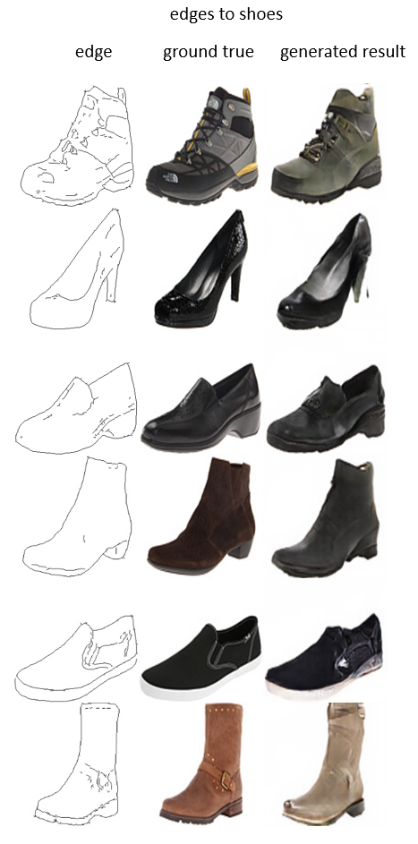

# MXNET-Scala Pix2Pix
MXNet-scala module implementation of Pix2Pix[1].

Based on: 
https://github.com/phillipi/pix2pix

I reproduced the results of the 'edge2shoes' and 'edges2handbags' datasets successfully.
But the results on the 'cityscapes' and 'facades' datasets were not good enough, so I did not show the results of them.

## Results:

<div align='center'>
  
</div>

<div align='center'>
  
</div>

### Requirements

* sbt 0.13 http://www.scala-sbt.org/
* Mxnet https://github.com/dmlc/mxnet

### steps

1, compile Mxnet with CUDA, then compile the scala-pkg，doc： https://github.com/dmlc/mxnet/tree/master/scala-package

2, under the Mxnet-Scala/Pix2Pix folder 
```bah
 mkdir lib;
```
3, copy your compiled mxnet-full_2.11-linux-x86_64-gpu-0.10.0-SNAPSHOT.jar into lib folder;

4, run `sbt` then compile the project

## Datasets
You can download the datasets with the `datasets/download_dataset.sh`. you can refer to https://github.com/phillipi/pix2pix
for how to use this script.

## Training new models

Use the `train_pix2pix.sh` script under `scripts` folder.
If you keep all the default settings, you just need to provide the dataset path, and set the direction 'AtoB' or 'BtoA'
```bash
DATA_PATH=
DIRECTION=
```

## Testing

I did not release the pretrained models because the model size is too large ~200M.

But you can reproduce the results by using the `train_pix2pix.sh` script to train your own model.

Use the `test_pix2pix.sh` script under `scripts` folder.

You need to provide the input image path, pretrain model path and set the corresponding direction.

```bash
PREAREIN_G_MODEL=

INPUT_IMAGE=

# -1 for cpu
GPU=0

# "AtoB" or "BtoA"
DIRECTION="BtoA"
```

## License
MIT

## Reference
[1] Isola, Phillip, et al. "Image-to-image translation with conditional adversarial networks." 2016.
