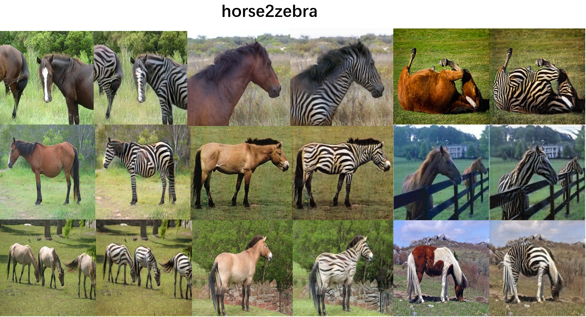
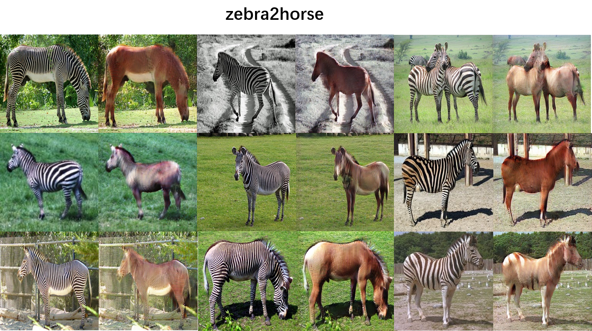
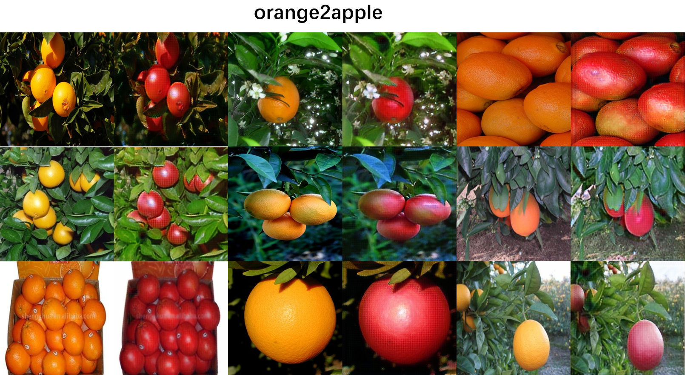

# Implementation of [CycleGan](https://junyanz.github.io/CycleGAN/) with [Oneflow](https://github.com/Oneflow-inc/oneflow) framework.

This work is based on the repo: https://github.com/junyanz/pytorch-CycleGAN-and-pix2pix

## Results:


### For horse to zebra task, I have trained the model for just about 73 epochs.

<div align='center'>
  
</div>

<div align='center'>
  
</div>

### For apple to orange task, I have trained the model for just about 38 epochs.

<div align='center'>
  
</div>

<div align='center'>
  
</div>


## Tested on
| Spec                        |                                                             |
|-----------------------------|-------------------------------------------------------------|
| Operating System            | Ubuntu 20                                             |
| GPU                         | Nvidia GTX 1070                                          |
| CUDA Version                | 10.2                                                        |
| Driver Version              | 440.100                                                      |

## Requirements
* python3
    - numpy
    - opencv
* Oneflow: https://github.com/Oneflow-inc/oneflow

## Train with new task

1, download datasets with the script：https://github.com/junyanz/pytorch-CycleGAN-and-pix2pix/blob/master/datasets/download_cyclegan_dataset.sh

2, using the script `train.sh` to train on new style image

Something users need to configure:

- `CHECKPOINT_LOAD_DIR`: you can resume the training process by providing the previous saved checkpoint path
- `CHECKPOINT_SAVE_DIR`: save the checkpoints during the training process, created by user
- `TRAIN_DATASET_A`: domain A images
- `TRAIN_DATASET_B`: domain B images

```bash
CHECKPOINT_LOAD_DIR="./checkpoints/epoch_38_iter_400_gloss_5.349748_dloss_0.334908"

# make sure $CHECKPOINT_SAVE_DIR is already exists before start the training process.
CHECKPOINT_SAVE_DIR="./checkpoints"

#
TRAIN_DATASET_A="./datasets/summer2winter_yosemite/trainA"
TRAIN_DATASET_B="./datasets/summer2winter_yosemite/trainB"

RESIZE_AND_CROP=True
CROP_SIZE=256
LOAD_SIZE=286

SAVE_TMP_IMAGE_PATH="./training_cyclegan.jpg"

EPOCH=300
LR=0.0002

LAMBDA_A=10.0 
LAMBDA_B=10.0
LAMBDA_IDENTITY=0.5

python3 train_of_cyclegan.py \
    --datasetA_path $TRAIN_DATASET_A \
    --datasetB_path $TRAIN_DATASET_B \
    --resize_and_crop $RESIZE_AND_CROP \
    --crop_size $CROP_SIZE \
    --load_size $LOAD_SIZE \
    --save_tmp_image_path $SAVE_TMP_IMAGE_PATH \
    --train_epoch $EPOCH \
    --learning_rate $LR \
    --lambda_A $LAMBDA_A \
    --lambda_B $LAMBDA_B \
    --lambda_identity $LAMBDA_IDENTITY \
    --checkpoint_save_dir $CHECKPOINT_SAVE_DIR \
    # --checkpoint_load_dir $CHECKPOINT_LOAD_DIR
```

## Test Pretrained Model on Images

```bash
CHECKPOINT_LOAD_DIR="./pretrain_models/horse2zebra_epoch_73_iter_200_gloss_3.497316_dloss_0.253239/"

NET_IN_SIZE=256

# user just need to provide the directory containing the images
INPUT_IMAGES="./datasets/horse2zebra/testB/"
OUTPUT_IMAGES="./outputs/horse2zebra/outB2A/"

# transform domain A images to domain B
# DIRECTION="A2B"
# transform domain B images to domain A
DIRECTION="B2A"

python3 test_of_cyclegan.py \
    --input_images $INPUT_IMAGES \
    --network_input_size $NET_IN_SIZE \
    --output_images $OUTPUT_IMAGES \
    --direction $DIRECTION \
    --checkpoint_load_dir $CHECKPOINT_LOAD_DIR
```
