# Implementation of [Fast Neural Style](https://arxiv.org/abs/1603.08155) with [Oneflow](https://github.com/Oneflow-inc/oneflow) framework.

This work is based on the repo: https://github.com/pytorch/examples/tree/master/fast_neural_style

The results are not as good as the pytorch version but not bad anyway :)

## Results:

<div align='center'>
  
  
</div>
<br>
<div align='center'>
  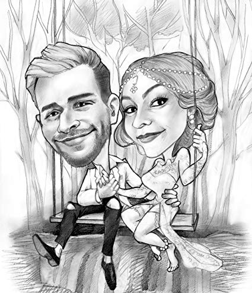
  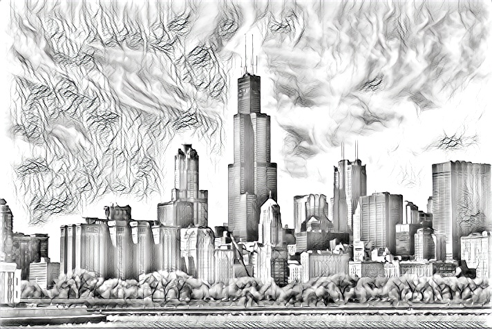
  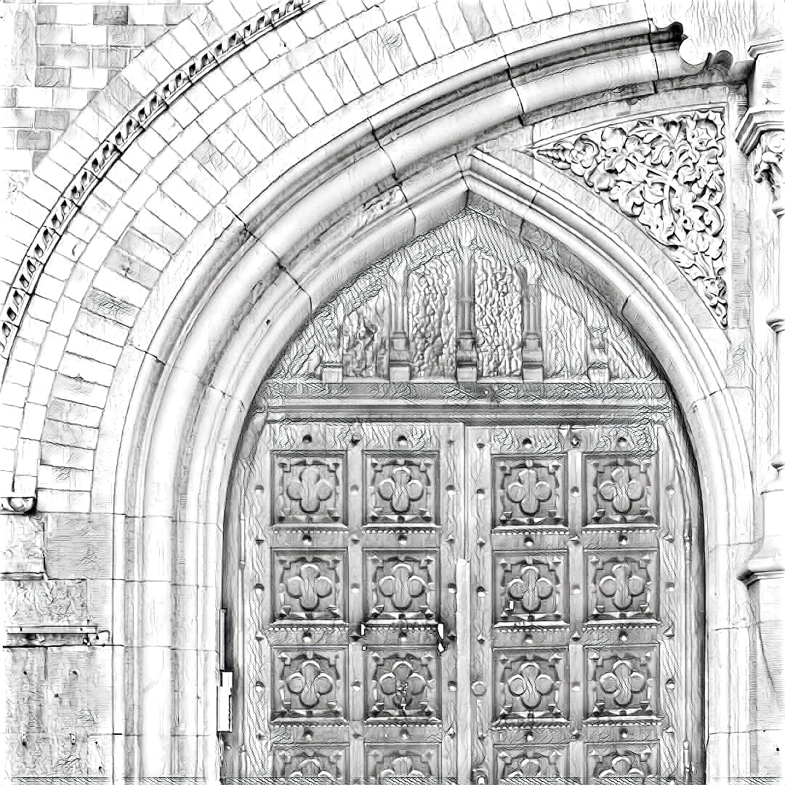
</div>

<div align='center'>
  
  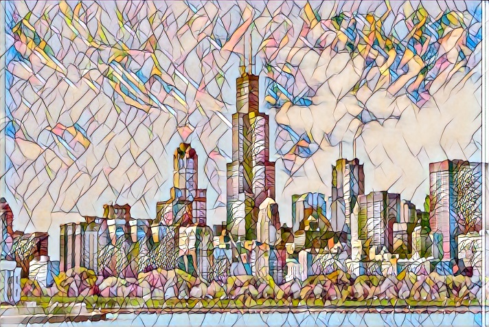
  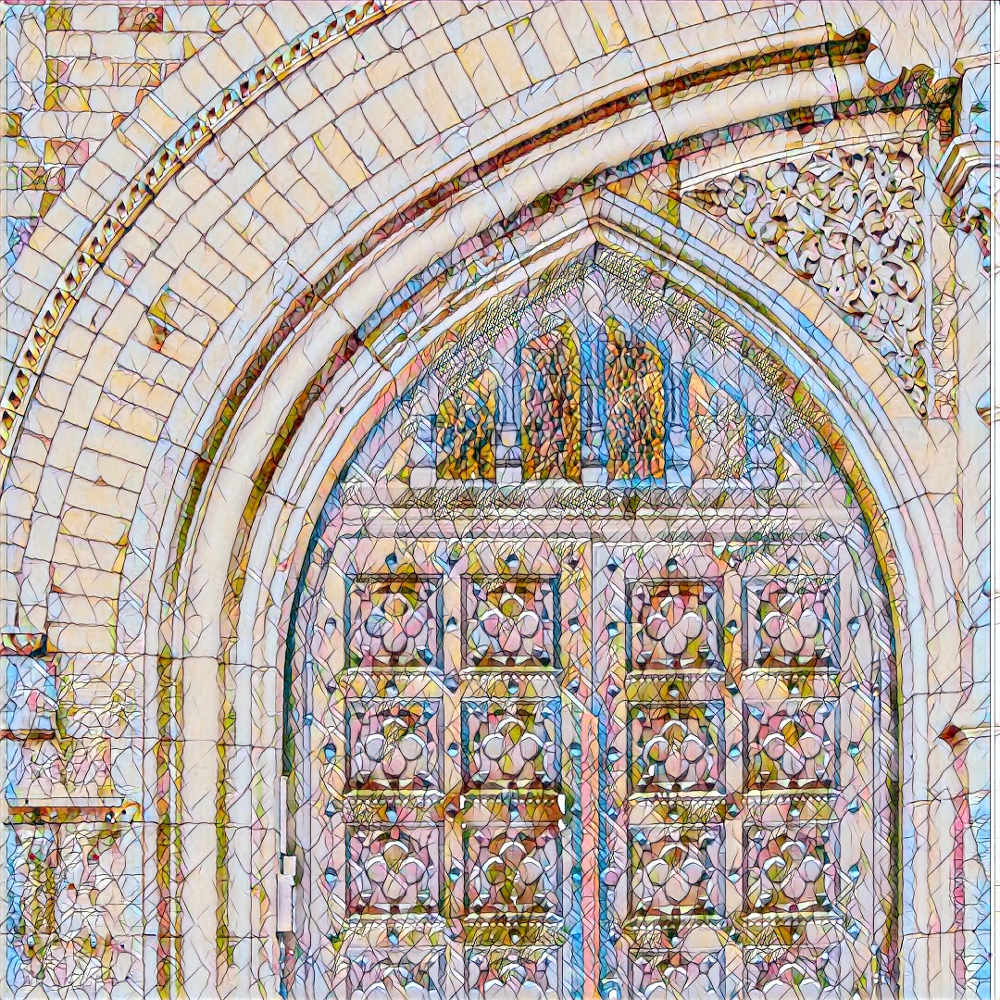
</div>

<div align='center'>
  
  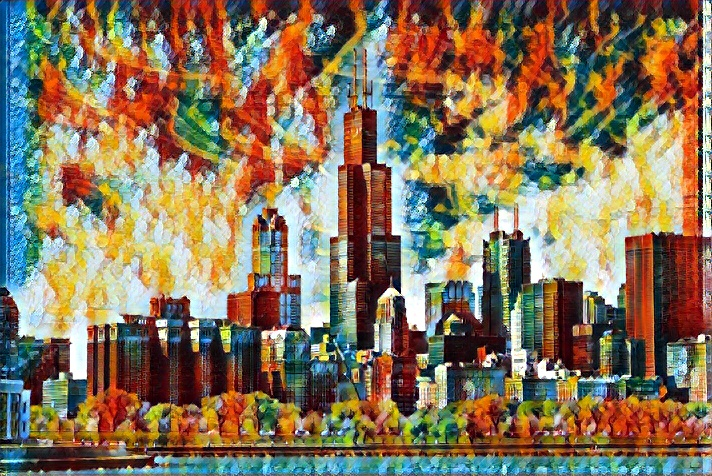
  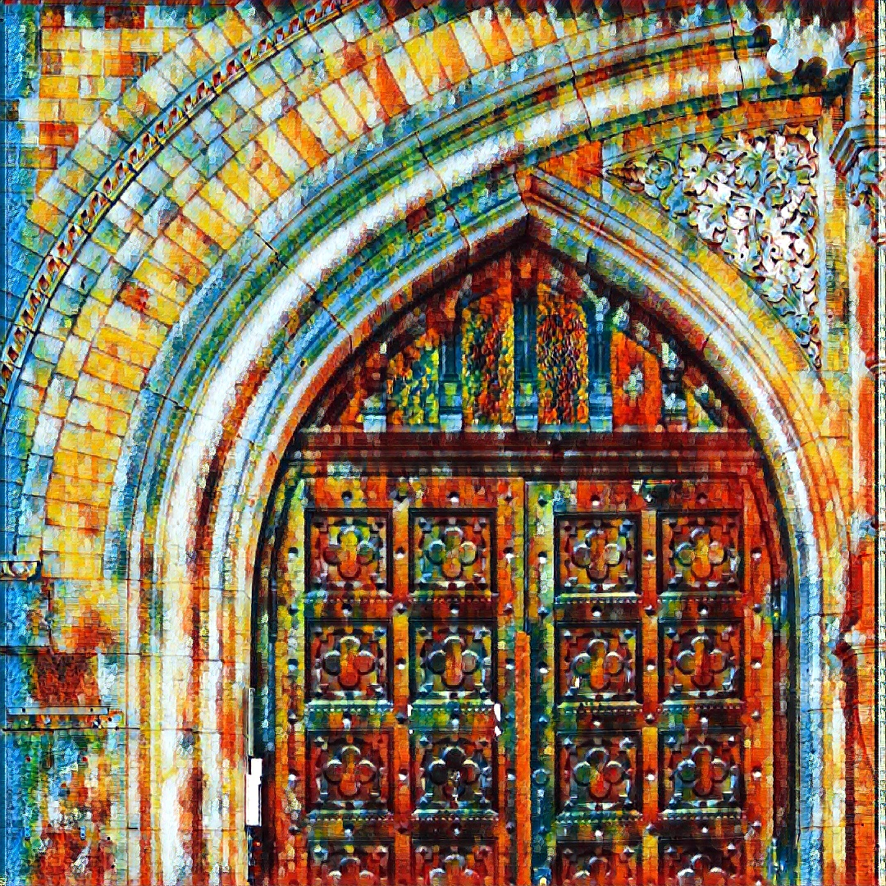
</div>

<div align='center'>
  
  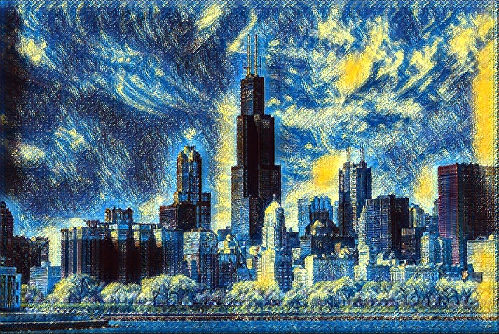
  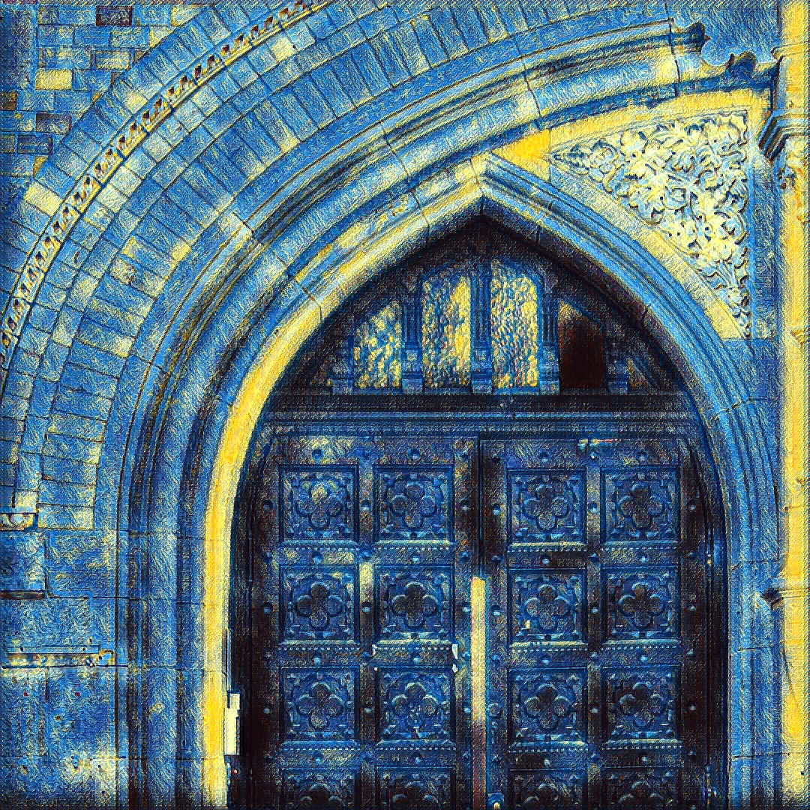
</div>

<div align='center'>
  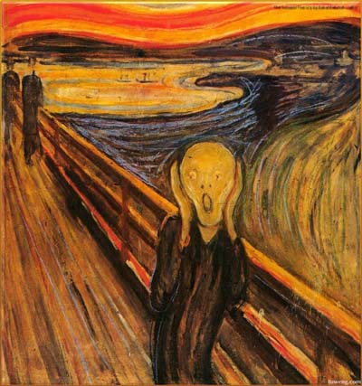
  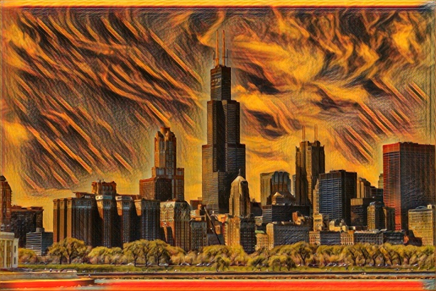
  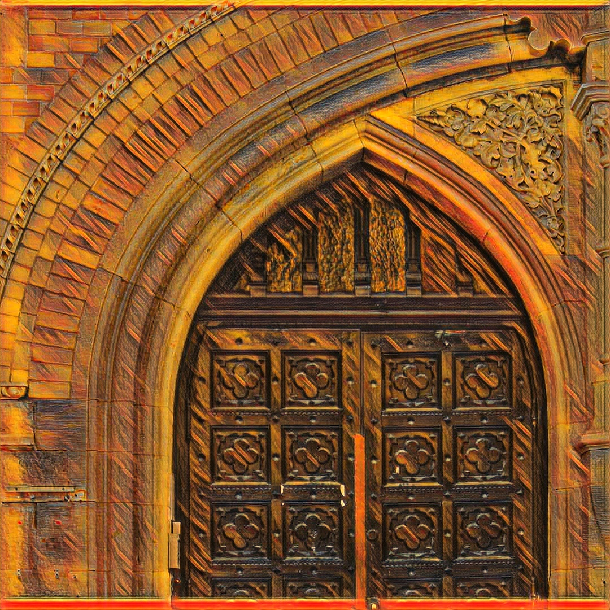
</div>

<div align='center'>
  
  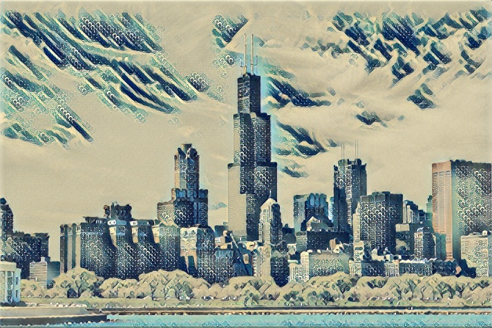
  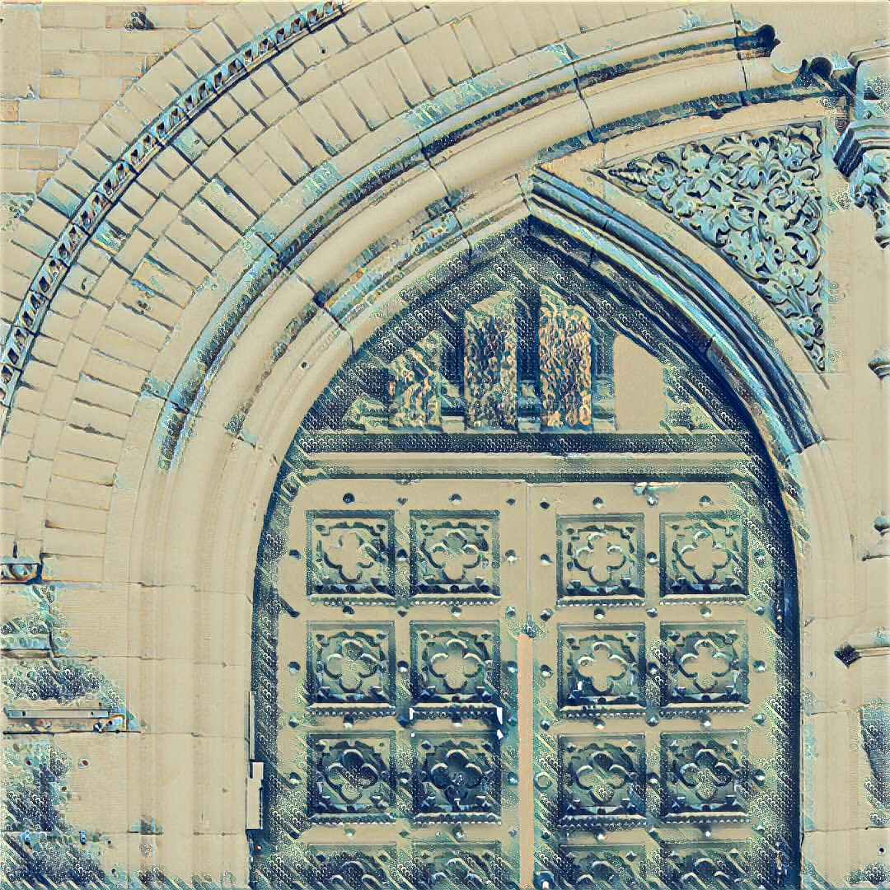
</div>


## Environment
| Spec                        |                                                             |
|-----------------------------|-------------------------------------------------------------|
| Operating System            | Ubuntu 20                                             |
| GPU                         | Nvidia GTX 1070                                          |
| CUDA Version                | 10.2                                                        |
| Driver Version              | 440.100                                                      |
| Oneflow Version 	| branch: master, commit_id: c8695c0c3768fd3d154c22fa1c997907e4b46666    |

## Inference time

421.849 milliseconds for resolution of 1080 x 1080.

## Requirements
* python3
    - numpy
    - opencv
* [Oneflow](https://github.com/Oneflow-inc/oneflow)


## Pretrain Models

[mosaic](https://oneflow-public.oss-cn-beijing.aliyuncs.com/model_zoo/cv/fast_neural_style/FastNeuralStyle_mosaic.zip)
[rain_princess](https://oneflow-public.oss-cn-beijing.aliyuncs.com/model_zoo/cv/fast_neural_style/FastNeuralStyle_rain_princess.zip)
[scream](https://oneflow-public.oss-cn-beijing.aliyuncs.com/model_zoo/cv/fast_neural_style/FastNeuralStyle_scream.zip)
[sketch](https://oneflow-public.oss-cn-beijing.aliyuncs.com/model_zoo/cv/fast_neural_style/FastNeuralStyle_sketch.zip)
[starry_night](https://oneflow-public.oss-cn-beijing.aliyuncs.com/model_zoo/cv/fast_neural_style/FastNeuralStyle_starry_night.zip)
[wave_crop](https://oneflow-public.oss-cn-beijing.aliyuncs.com/model_zoo/cv/fast_neural_style/FastNeuralStyle_wave_crop.zip)

## Test Pretrained Style Transfer Model on Images

`tar zxf pretrain_models.tar.gz`(in order to get the pretrain_models.tar.gz correctly during git clone, users need to install [git lfs](https://github.com/git-lfs/git-lfs/wiki/Installation)) to get the pretrain_models then use the script `infer.sh` to stylize image:

```bash
MODEL_LOAD_DIR="pretrain_models/sketch_lr_0.001000_cw_10000.000000_sw_10000000000.000000_epoch_0_iter_4400_loss_3008.877197/"

INPUT_IMAGE="./images/content-images/amber.jpg"
OUTPUT_IMAGE="./images/style_out_amber.jpg"

python3 infer_of_neural_style.py \
    --input_image_path $INPUT_IMAGE \
    --output_image_path $OUTPUT_IMAGE \
    --model_load_dir $MODEL_LOAD_DIR
```

## Training with New Style

1, download the VGG16 pretrain model(~900MB): https://oneflow-public.oss-cn-beijing.aliyuncs.com/model_zoo/vgg16_of_best_model_val_top1_721.zip

2, download the Coco dataset：http://msvocds.blob.core.windows.net/coco2015/test2015.zip

3, use the script `train.sh` to train on new style image

Something users need to configure:

- `MODEL_LOAD_DIR`: VGG16 pretrained model path
- `MODEL_SAVE_DIR`: save the checkpoints during the training process, created by yourself
- `STYLE_IMAGE`: your own style image
- `TRAIN_DATASET_PATH`: coco dataset path

```bash
MODEL_LOAD_DIR="./vgg16_of_best_model_val_top1_721"

# make sure $MODEL_SAVE_DIR is already exists before start the training process.
MODEL_SAVE_DIR="./checkpoints"

RGB_MEAN="123.68,116.779,103.939"
RGB_STD="58.393,57.12,57.375"

STYLE_IMAGE="./images/style-images/sketch.jpg"

# download from http://msvocds.blob.core.windows.net/coco2015/test2015.zip
TRAIN_DATASET_PATH="./Coco/test2015"

IMAGE_SIZE=256

# The setting of content_weight and style_weight depends on the style you want to transfer.
CW=10000 # sketch
SW=1e10

LR=0.001

python3 train_of_neural_style.py \
    --style_image_path $STYLE_IMAGE \
    --dataset_path $TRAIN_DATASET_PATH \
    --learning_rate $LR  \
    --rgb_mean $RGB_MEAN \
    --rgb_std $RGB_STD \
    --content_weight $CW \
    --style_weight $SW \
    --train_image_size $IMAGE_SIZE \
    --model_save_dir $MODEL_SAVE_DIR \
    --model_load_dir $MODEL_LOAD_DIR
```

## Reference
[1] Johnson, Justin, Alexandre Alahi, and Li Fei-Fei. "Perceptual losses for real-time style transfer and super-resolution." arXiv preprint arXiv:1603.08155.

